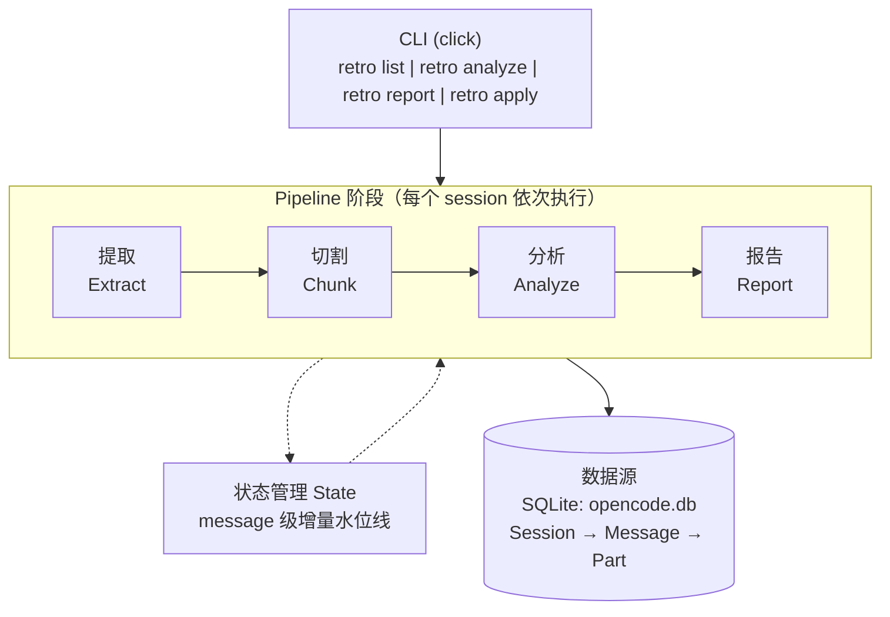

# OpenCode 会话回顾分析 — 设计文档

## 概述

一个 Python CLI 工具，回顾性分析 OpenCode AI 编码会话，提取知识、发现失败模式、产出可执行的改进建议（skill 草案、知识库条目、模式文档）。

**核心价值：** 将 990+ 积累的会话转化为可复用的知识库，避免同类问题反复探索。

**最终目标：** 跑通后固化为 OpenCode skill，可随时对任意有价值的会话执行分析。

---

## 关键设计决策

| 决策项 | 选择 | 理由 |
|--------|------|------|
| LLM | DeepSeek V4 Pro (via new-api) | 便宜、限制 400K 上下文、够用 |
| 数据源 | 直接读 SQLite | 增量能力最强，第三方工具不支持 message 级增量 |
| 增量粒度 | **Message 级**（非 session 级） | 大会话只分析新增部分，避免重复分析 |
| 输出流程 | 分析 → 建议报告 → 人工确认 → 执行补充 | Human-in-the-loop |
| Subagent | 摘要模式（1-2 行描述结果） | 节省 token，细节不影响质量判断 |

---

## 架构



---

## 项目结构

```
opencode_review/
├── src/
│   └── opencode_review/
│       ├── __init__.py
│       ├── cli.py              # Click CLI 入口
│       ├── db.py               # SQLite 读取，查询辅助
│       ├── extractor.py        # Session → 标准化对话
│       ├── chunker.py          # 语义切割逻辑
│       ├── analyzer.py         # LLM 分析调用
│       ├── reporter.py         # Markdown 报告生成
│       ├── state.py            # 增量状态追踪（message 级水位线）
│       └── models.py           # 数据类定义
├── prompts/
│   ├── chunk_boundary.txt      # Prompt：主题边界检测
│   └── block_analysis.txt      # Prompt：质量+失败分析
├── output/
│   ├── reports/                # 单 session Markdown 报告
│   └── recommendations/        # 待确认的建议（skill/KB）
├── .state/
│   └── processed.json          # 增量处理状态
├── config.yaml                 # 配置文件
├── pyproject.toml
└── DESIGN.md
```

---

## 数据模型

```python
@dataclass
class SessionMeta:
    id: str
    parent_id: str | None       # None = 顶层 session
    created_at: datetime
    message_count: int
    has_children: bool          # 有 subagent session
    title: str | None           # 第一条 user message 前 50 字
    project_path: str | None    # 工作目录

@dataclass
class NormalizedTurn:
    role: str                   # "user" | "assistant" | "subagent_summary"
    content: str                # 清洗后文本
    turn_index: int
    message_id: str             # 原始 message id，用于增量水位线
    has_tool_calls: bool
    tool_names: list[str]       # e.g. ["bash", "read", "write"]

@dataclass
class SemanticChunk:
    chunk_id: str
    session_id: str
    turns: list[NormalizedTurn]
    start_message_index: int    # 在 session 内的 message 序号
    end_message_index: int
    token_count: int

@dataclass
class ChunkAnalysis:
    chunk_id: str
    topic_summary: str
    outcome: Literal["success", "partial", "failure", "unclear"]
    first_try_success: bool
    corrections_required: int
    skills_referenced: list[str]
    kb_referenced: list[str]
    failure_root_cause: str | None
    # "missing_skill" | "unclear_instruction" | "agent_limit" | "knowledge_gap"
    failure_detail: str | None
    missing_context: str | None
    recommendations: list[Recommendation]
    confidence: float

@dataclass
class Recommendation:
    type: str                   # "new_skill" | "kb_entry" | "skill_update" | "workflow"
    title: str                  # 简短标题
    detail: str                 # 具体建议内容
    priority: str               # "high" | "medium" | "low"
    source_chunk_id: str        # 来源 chunk
    status: str = "pending"     # "pending" | "approved" | "rejected" | "applied"
```

---

## 阶段 1：数据提取

### 2GB 问题

总数据 ~2.5GB，95% 是 tool 调用内容（文件读取、bash 输出）。LLM 不需要完整 tool output 来评估质量 — 只需知道「发生了什么」。

### Part 类型处理

| Part Type | 大小 | 处理方式 | 理由 |
|-----------|------|----------|------|
| `text` | 41MB | ✅ 完整保留 | 核心对话内容 |
| `reasoning` | 7.6MB | ⚠️ 截断到 500 字 | 看意图不需要全文 |
| `step-start/finish` | 30MB | ✅ 只提取 tool name | 结构信号 |
| `tool` | 2.1GB | ❌ 摘要为 1 行 | **数据量主要来源** |
| `patch` | 4MB | ⚠️ 只保留 diff 统计 | `+N/-N 行 in file.py` |
| `file` | 390MB | ❌ 只保留文件名+大小 | 内容对质量评估无用 |
| `compaction` | 56KB | ⚠️ 作为降级方案 | 原文丢失时用 compaction 摘要代替 |

### Tool 调用摘要格式

```
bash(command="npm test") → exit=1, stderr 12行 (失败)
read(file="src/auth.ts") → 340 行
write(file="src/auth.ts") → 成功
task(subagent="explore", desc="Find auth") → 完成
```

### Subagent 处理

**策略：摘要模式**（不完整 inline）

```python
def summarize_subagent(child_session_id: str, db: DB) -> str:
    """将 subagent session 压缩为 1-2 行摘要"""
    child_meta = db.get_session_meta(child_session_id)
    # 取最后一条 assistant text message 作为结果摘要
    last_response = db.get_last_assistant_text(child_session_id)
    return f"[子任务: {child_meta.title}] 结果: {last_response[:200]}"
```

理由：subagent 的细节对失败归因不重要，重要的是「父任务要求了什么、子任务返回了什么」。

---

## 阶段 2：语义切割

### 目标

将 session 切分为独立的**任务块**。每个块 = 一个用户意图 + agent 执行周期。

### 算法：规则为主 + LLM 兜底

**第一阶段：规则切割（免费、快速）**

边界信号（任一触发即为候选边界）：
- Assistant 发出完成信号（"done"、"完成"、"let me know"）后的下一条 user message
- 明确的话题切换："现在来"、"next"、"另外"、"顺便"
- Tool 模式突变：工具序列完全不同（如 10 轮 bash → 突然开始 read/write）
- 时间间隔 > 30 分钟
- 用户在子任务完成后发出新的高级指令

**第二阶段：LLM 边界修正（仅对异常 chunk）**

仅当规则产出 chunk > 8000 tokens 或 < 3 turns 时调用：

```
Prompt (chunk_boundary.txt):
给定以下对话片段，判断用户意图在哪里切换到了新的独立任务。
返回 JSON: {"boundaries": [turn_index, ...], "confidence": 0.0-1.0}
只在明确不同主题时切割。如果不确定，保持为一个 chunk。
```

**目标 chunk 大小：** 20-80 turns，提取后 ~2000-6000 tokens。

**小 session（<10 turns）：** 视为单 chunk，跳过边界检测。

---

## 阶段 3：LLM 分析

### 模型配置

```yaml
llm:
  base_url: https://aitool-api.businsights.net/v1
  api_key: sk-4hp7LRsv8aGAcdoCK4dYv3eaPBe5OAtIcuUBLjysXXoTJ30t
  model: deepseek-v4-pro       # OpenAI 兼容格式
  temperature: 0
  max_tokens: 4000
```

### 分析 Prompt

```
你正在分析一段 AI 编码助手会话的任务块。

对话内容：
{normalized_turns}

上下文：
- 总轮数: {turn_count}
- 使用的工具: {tool_summary}
- 会话日期: {date}
- 当时可用的 skill: {skill_list}

任务：分析此块并返回 JSON：
{
  "topic": "一句话描述尝试做什么",
  "outcome": "success|partial|failure|unclear",
  "first_try_success": true|false,
  "corrections_required": N,
  "skills_referenced": ["skill_name"],
  "kb_referenced": ["kb_name"],
  "failure_root_cause": null | "missing_skill|unclear_instruction|agent_limit|knowledge_gap",
  "failure_detail": "一句话解释什么出了问题",
  "missing_context": "什么信息/skill/模式可以让首次就成功",
  "recommendations": [
    {
      "type": "new_skill|kb_entry|skill_update|workflow",
      "title": "简短标题",
      "detail": "具体建议",
      "priority": "high|medium|low"
    }
  ],
  "confidence": 0.0-1.0
}

规则：
- first_try_success = true 仅当 agent 完成任务且用户没有发送纠正
- 用户纠正包括："不对"、"我是说"、"改一下"、"actually"、重述同样的请求
- outcome = "success" 要求任务完全完成且用户满意
- outcome = "partial" = 最终完成但经过纠正
- outcome = "failure" = 从未完成或用户放弃
- missing_context 要具体（如"lark-base 字段公式语法的 skill"而非"更多上下文"）
- 忽略风格偏好（"我喜欢X"）— 只标记实质性失败
- recommendations 不超过 3 条
```

### 成本估算

DeepSeek V4 Pro 定价（via new-api）：
- Input: ~¥1/1M tokens
- Output: ~¥2/1M tokens

| 场景 | Sessions | 预估成本 |
|------|----------|----------|
| 全量 990 sessions | 990 | < ¥5 |
| 每周增量 (~50 new) | 50 | < ¥0.5 |
| 单 session 分析 | 1 | < ¥0.01 |

---

## 阶段 4：报告生成

### 单 Session 报告 (`output/reports/{session_id}.md`)

```markdown
# 会话分析: {title}
**日期:** {date} | **时长:** {duration} | **消息数:** {count} | **项目:** {path}

## 摘要
{2-3 句话 session 概述}

## 任务块

### 块 1: {topic}
- **结果:** ✅ 一次成功
- **工具:** bash, read, write
- **轮数:** 12
- **Skills:** lark-im

> {简要描述}

---

### 块 2: {topic}
- **结果:** ⚠️ 部分成功（2 次纠正）
- **工具:** bash, lark-cli
- **轮数:** 23
- **Skills:** 无

> {描述}

**根因:** 缺少 skill — 没有 X 操作的文档化流程
**缺失内容:** Y 模式的 skill
**建议:** 创建 `lark-Y` skill 文档化 Z 流程

---

## 质量评分卡
| 指标 | 值 |
|------|-----|
| 分析块数 | 3 |
| 一次成功率 | 67% (2/3) |
| 失败数 | 0 |
| 引用的 Skills | lark-im, lark-base |
| 发现的知识缺口 | 1 |

## 待确认建议
1. **[新 Skill]** 创建 `lark-Y` 用于 Z 流程
2. **[知识库]** 将 X 模式补充到知识库
```

---

## 阶段 5：增量状态管理（Message 级）

### 核心设计：Message 级水位线

不同于 session 级增量（整个 session 要么跑过，要么没跑过），我们追踪每个 session 已分析到第几条 message。

### 状态文件: `.state/processed.json`

```json
{
  "schema_version": 2,
  "last_run": "2026-05-25T10:00:00Z",
  "sessions": {
    "ses_abc123": {
      "analyzed_at": "2026-05-20T08:00:00Z",
      "analyzed_up_to_message_index": 47,
      "total_messages_at_analysis": 47,
      "chunks": [
        {"chunk_id": "c1", "start_idx": 0, "end_idx": 22},
        {"chunk_id": "c2", "start_idx": 23, "end_idx": 47}
      ],
      "report_path": "output/reports/ses_abc123.md",
      "outcome_summary": {"success": 2, "partial": 1, "failure": 0}
    }
  }
}
```

### 增量处理逻辑

```python
def get_unanalyzed_messages(session_id: str, state: dict, db: DB) -> tuple[int, int]:
    """返回 (start_index, end_index) 指示需要分析的 message 范围"""
    current_msg_count = db.get_message_count(session_id)
    prev = state["sessions"].get(session_id)

    if prev is None:
        return (0, current_msg_count)  # 全新 session，全部分析

    if current_msg_count > prev["analyzed_up_to_message_index"]:
        return (prev["analyzed_up_to_message_index"], current_msg_count)  # 只分析新增

    return None  # 无变化，跳过
```

### 上下文衔接

当增量分析新增 message 时，取前一个 chunk 的最后 3 条 message 作为 overlap context：

```python
def get_overlap_context(session_id: str, state: dict, db: DB) -> list[NormalizedTurn]:
    """获取前一轮分析的尾部 context，用于衔接"""
    prev = state["sessions"].get(session_id)
    if prev is None or not prev["chunks"]:
        return []

    last_chunk = prev["chunks"][-1]
    # 取最后一个 chunk 的最后 3 条 turn 作为 overlap
    return db.get_turns(session_id, last_chunk["end_idx"] - 3, last_chunk["end_idx"])
```

---

## Human-in-the-loop 流程

### 工作流

```
1. retro analyze <session_id>
   → 分析完成，生成报告 + 建议列表

2. retro report <session_id>
   → 查看报告和建议

3. retro apply <session_id>
   → 交互式确认每条建议：
     [1/3] 新 Skill: lark-base-formula
           详情: 文档化多维表格公式字段的创建流程...
           (a)pprove / (r)eject / (s)kip? > a

   → 确认后自动执行：
     - new_skill → 生成 skill 骨架到 ~/.agents/skills/ 或 ~/.config/opencode/skills/
     - kb_entry → 调用 lastwar-kb-write 写入知识库
     - skill_update → 修改现有 skill 文件
```

### 建议状态流转

```
pending → approved → applied
              ↓
          rejected (不再提示)
```

---

## CLI 接口

```bash
# 列出 session 及元数据
retro list [--limit 20] [--since 7d] [--unanalyzed-only] [--project PATH]

# 分析指定 session
retro analyze <session_id> [session_id ...]
retro analyze --all                    # 所有未处理的
retro analyze --since 7d               # 最近 7 天的新/变化 session

# 查看报告
retro report <session_id>              # 单 session 报告
retro report --aggregate [--since 7d]  # 跨 session 聚合

# 审阅并执行建议
retro apply <session_id>               # 交互式确认
retro apply --auto                     # 全部自动批准（谨慎使用）

# 状态管理
retro status                           # 显示已处理/待处理统计
retro reset <session_id>               # 强制重新分析
retro reset --all                      # 重置所有
```

---

## 配置 (`config.yaml`)

```yaml
db_path: ~/.local/share/opencode/opencode.db
output_dir: ./output
state_dir: ./.state

llm:
  base_url: https://aitool-api.businsights.net/v1
  api_key: sk-4hp7LRsv8aGAcdoCK4dYv3eaPBe5OAtIcuUBLjysXXoTJ30t
  model: deepseek-v4-pro
  max_context: 400000            # 模型支持 1M，但限制 400K 避免幻觉
  temperature: 0
  max_tokens: 4000

extraction:
  max_reasoning_chars: 500
  max_tool_summary_chars: 200
  subagent_mode: summary          # "summary" | "inline"
  skip_sessions_under_messages: 5

chunking:
  target_min_turns: 3
  target_max_tokens: 6000
  time_gap_boundary_minutes: 30
  use_llm_refinement: true

analysis:
  confidence_threshold: 0.5       # 低于此值 → 标记需人工审核
  max_recommendations_per_chunk: 3

apply:
  skill_output_dir: ~/.config/opencode/skills
  kb_write_enabled: true          # 是否允许自动写入知识库
```

---

## 固化为 Skill 的计划

跑通单 session 端到端测试后，将整个流程封装为 OpenCode skill：

```
~/.config/opencode/skills/session-review/
├── SKILL.md                    # Skill 描述 + 触发条件
└── scripts/                    # 可选：内嵌脚本
```

**触发词：** "分析会话"、"review session"、"会话回顾"、"retro"

**Skill 内容：** 指导 agent 执行 `retro analyze` → 展示报告 → 等待确认 → 执行 `retro apply`

---

## 测试计划

### 单 Session 端到端测试

1. 选一个中等复杂度的历史 session（~50 messages，有成功有失败）
2. 跑完整 pipeline：extract → chunk → analyze → report
3. 验证：
   - 提取是否正确处理了 tool 摘要
   - 切割是否合理（每块一个任务）
   - 分析是否准确识别了成功/失败
   - 建议是否可执行
4. 增量测试：模拟 session 新增消息，验证只分析新增部分

### 验收标准

- [ ] 单 session 分析 < 30 秒
- [ ] Token 消耗与预估匹配（< ¥0.01/session）
- [ ] 报告可读、建议可执行
- [ ] 增量分析正确（不重复分析旧内容）
- [ ] 建议确认→执行流程跑通
